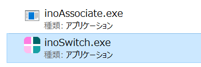
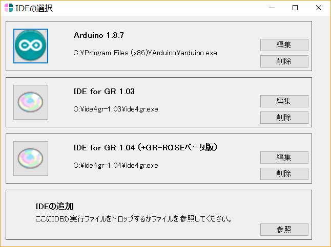
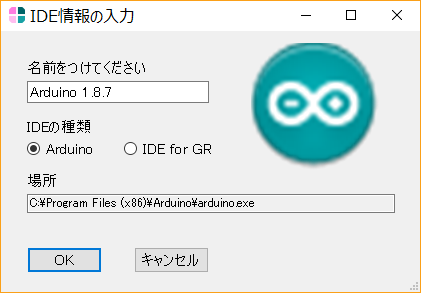
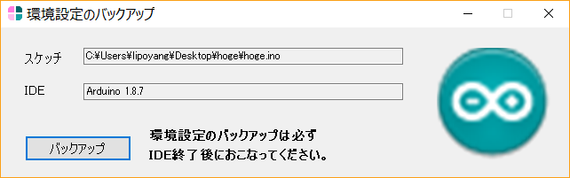

# inoSwitch (ベータ版)
Arduino系IDE設定切替ツール

## できること
* スケッチごとに開くIDEを選択できる。
* 次回からはそのスケッチは選択したIDEで開かれる。
* インストール場所の異なる複数のIDEを登録できる。
* スケッチごとにIDEの設定(preferences.txt)を保存できる。

## 対応OS
* Windowsのみ (Windows 10 64bit版で動作確認)

## 対応IDE (動作確認が取れているIDE)
* 本家 Arduino IDE
* がじぇっとるねさす IDE for GR

(この二つはpreferences.txtの保存場所が異なるために区別しているだけ)

## 使いかた

### (1) インストール
* [こちら](https://github.com/lipoyang/inoSwitch/releases) から inoSwitch.zip をダウンロードし、適当な場所に解凍してください。inoSwitch.exe がアプリ本体です。

### (2) IDEの登録
* はじめてinoSwitch.exeを実行すると、スケッチファイル(*.ino)をinoSwitchに関連付けるか確認されます。本ツールを利用するためには関連付けをおこなってください。
* ツールが起動すると「IDEの選択」の画面になります。ここで登録したいIDEの実行ファイル(ardino.exe や ide4gr.exe)を「IDEの追加」の欄にドラッグ＆ドロップするか、「参照」ボタンでファイルを選んで、IDEを登録してください。

* IDEには任意の名前を付けることができます。また、本家のArduino IDEか、がじぇっとるねさすのIDE for GRかの設定を確認してください。(通常は自動判別されます。)

* 登録が終わったらアプリを閉じます。

### (3) スケッチを開く
* 開きたいスケッチファイルをダブルクリックすると、「IDEの選択」の画面になります。ここでどのIDEで開くかを選びます。
* どのIDEを選択したかは、スケッチファイルと同じフォルダのinoSketch.txtに記録され、次回からはスケッチファイルをダブルクリックするとそのIDEで開かれます。

* IDEが起動したあとは、inoSwitchは「環境設定のバックアップ」の画面になります。
* 「保存」ボタンを押すと、Arduino系IDEの設定ファイルである preferences.txt がスケッチファイルと同じフォルダにバックアップされます。
* 必ず、IDEを閉じた後で「バックアップ」ボタンを押すようにしてください。 preferences.txt はIDEの終了時に設定が保存されます。

* 次にスケッチを開くときに、バックアップされた設定ファイルとシステムの設定ファイルが異なっていれば、設定を上書きするか確認されます。「はい」を選択するとバックアップした設定ファイルがシステムにコピーされます。

